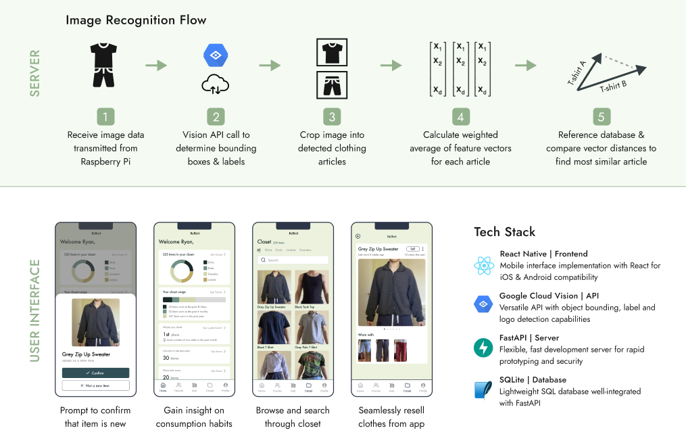

# Reflect 🪞

- [Backend](#backend)
- [Frontend](#frontend)
- [Recognition](#recognition)

This project leverages clothing recognition to help users digitize their wardrobe and develop sustainable consumer habits.



## Backend

Switch to Python environment run: `source reflect/bin/activate`

Start Backend by running: `uvicorn main:app --reload`

Localtunnel is used to expose the server port (8000).
Follow these instructions to [quickstart localtunnel](https://theboroer.github.io/localtunnel-www/).
To start the server https://reflect.loca.lt run the command: `lt -p 8000 -s reflect`

Browse API docs at: https://reflect.loca.lt/docs

## Frontend

Ensure that backend is running, and the port is exposed in the above steps.

Run `npm start` to start a local development server.

[Expo Go](https://expo.dev/client) can be downloaded to emulate the application on your phone.

## Recognition

Request the latest `service.json` and place in `./recognition` to enable Google Cloud APIs

````
{
  "type": "service_account",
  "project_id": "reflect-415121",
  ...
}```

````
